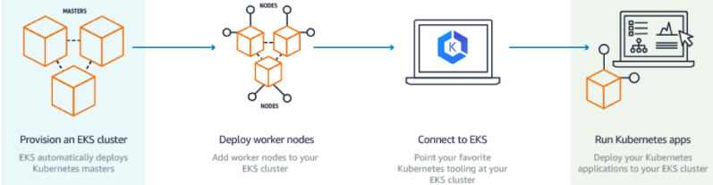

# Amazon_EKS

EKS stands for Elastic Kubernetes Service, which is an Amazon offering that helps in running the Kubernetes on AWS without requiring the user to maintain their own Kubernetes control plane. It is a fully managed service by Amazon.  

Amazon EKS helps run Kubernetes control plane instances over multiple Availability Zones which makes sure that they are highlyavailable. Amazon EKS automatically detects and replaces control plane instances that are unhealthy, as well as provisioning automated version upgrades and patching for the unhealthy control planes. 
 

Amazon EKS can be integrated with other Amazon service in order to provide scalability and security for user applications, and some of the services have been listed below: 

1.Authentication is served by IAM.  
2.Isolation is served by Amazon VPC.  
3.Amazon ECR for container images.  
4.Elastic Load Balancing service to distribute the load. 

Amazon EKS helps run up-to-date version of the open-source Kubernetes software, thereby allowing the user to use all the existing plugins and tooling which is availability in the Kubernetes community. Applications that run on Amazon EKS are completely compatible with applications which run on other standard Kubernetes environment, be it running in on premise data centres or in public clouds. This indicates that the user can migrate to other standard Kubernetes application very easily without modifying any code.  

## Working of Amazon EKS 

  

## Steps to start Amazon EKS

* Create an Amazon EKS cluster with the AWS Management Console or AWS CLI or with one of the AWS SDKs. 
* Launch the worker node which registers the Amazon EKS cluster.  
* An AWS CloudFormation template can be provisioned that helps configure the nodes automatically.   
* When the cluster is ready, the user can configure it with the Kubernetes tools which is required for their application to communicate with their cluster. 
* This Amazon EKS cluster can be used to deploy and manage applications in the same manner as one would do with any other Kubernetes environment.  

